# Redis Foundation 设计说明

## 1. 文档目的

本文档描述 `component-base` 中 Redis Foundation 层的定位、边界、领域模型、领域服务、设计模式、包结构与关键交互流程。

Redis Foundation 是三仓共享的基础设施层，服务于：

- `component-base`
- `qs-server`
- `iam-contracts`

它只负责 **Redis 基础能力**，不负责业务缓存平台、缓存治理、业务 key schema，也不负责业务 repository。

---

## 2. 设计目标

Redis Foundation 的目标有四个：

1. 提供稳定的 Redis 运行时绑定能力  
   统一默认连接、命名 profile、fallback、健康状态与恢复机制。

2. 提供稳定的低层 Redis 原语  
   统一 keyspace、模式删除、原子消费、TTL 抖动等通用操作。

3. 提供最小 typed store 能力  
   统一简单值对象的 `Get/Set/Delete/Exists` 与编解码逻辑，减少下游重复。

4. 提供统一的 lease lock 原语  
   统一 `Acquire / Renew / Release / CheckOwnership` 语义，避免各仓各写一套锁逻辑。

---

## 3. 非目标

Foundation 明确不负责以下内容：

- `qs-server` 的 cache runtime
- `qs-server` 的 cache governance
- family/catalog/warmup/hotset/status page
- query cache / object cache / negative cache / read-through / singleflight
- `iam-contracts` 的 token、otp、access token 等业务 adapter
- 任何业务域对象的 repository 语义

一句话总结：

> Foundation 只负责 “如何可靠地使用 Redis”，不负责 “业务上为什么这么用 Redis”。

---

## 4. 总体架构

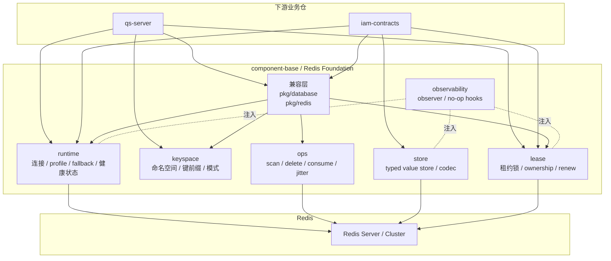

---

## 5. 分层与包结构

当前 Foundation 的稳定结构如下：

```text
pkg/redis/
├── FOUNDATION.md              # 本文档
├── doc.go                     # 兼容门面说明
├── keyspace/                  # 命名空间与键模式
├── ops/                       # 通用键操作
├── runtime/                   # 运行时与 profile 绑定
├── store/                     # typed value store
├── lease/                     # lease lock
├── observability/             # observer 契约
├── keyspace.go                # 兼容层
├── delete.go                  # 兼容层
├── consume.go                 # 兼容层
├── jitter.go                  # 兼容层
└── lock.go                    # 兼容层

pkg/database/
├── redis.go                   # RedisConnection 兼容层
└── redis_profile_registry.go  # NamedRedisRegistry 兼容层
```

这里有两类入口：

- **Foundation 新入口**
  - `pkg/redis/runtime`
  - `pkg/redis/keyspace`
  - `pkg/redis/ops`
  - `pkg/redis/store`
  - `pkg/redis/lease`
  - `pkg/redis/observability`

- **兼容入口**
  - `pkg/database`
  - `pkg/redis`

新代码应该优先使用新入口；旧入口用于平滑迁移。

---

## 6. 子域划分

Foundation 被拆成五个技术子域和一个横切子域：

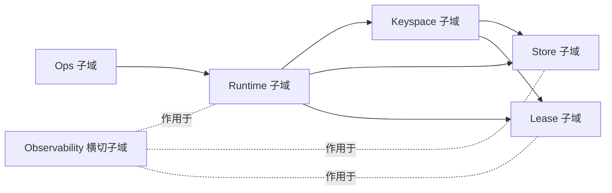

### 6.1 Runtime 子域

负责：

- 默认 Redis 连接
- 命名 profile
- profile fallback
- 健康探测
- 不可用状态与重试恢复

### 6.2 Keyspace 子域

负责：

- namespace 规范化
- keyspace 派生
- 前缀拼接
- 带命名空间的模式构造

### 6.3 Ops 子域

负责：

- `SCAN`
- `DeleteByPattern`
- `ConsumeIfExists`
- `JitterTTL`

### 6.4 Store 子域

负责：

- typed key
- typed value 编解码
- `Get/Set/Delete/Exists`
- `SetIfAbsent`
- 可选压缩 codec

### 6.5 Lease 子域

负责：

- lease key / token
- acquire
- renew
- release
- ownership check

### 6.6 Observability 横切子域

负责：

- command observer
- profile observer
- lease observer
- store observer
- no-op 默认实现

---

## 7. 领域模型

本层虽然是基础设施，但仍然采用显式的领域建模，让接口语义稳定、可复用、可迁移。

## 7.1 Runtime 子域模型

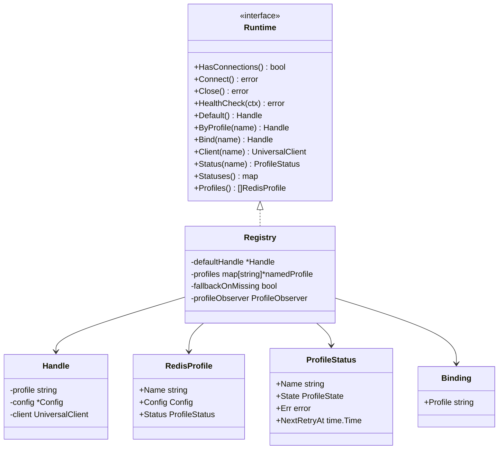

### 模型说明

- `Config`
  - Redis profile 的连接策略值对象
- `Binding`
  - “某个资源绑定哪个 profile”的值对象
- `ProfileStatus`
  - profile 当前状态快照
- `RedisProfile`
  - profile 的完整配置与状态视图
- `Handle`
  - 一个真正可用的 Redis 句柄，内部持有 `go-redis` client
- `Registry`
  - Runtime 聚合根

---

## 7.2 Keyspace 子域模型

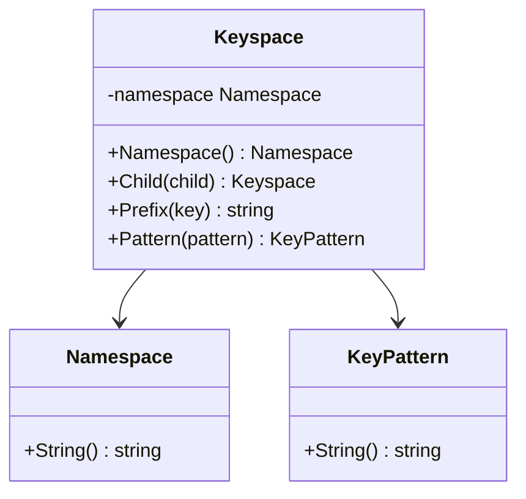

### 模型说明

- `Namespace`
  - 规范化后的命名空间值对象
- `Keyspace`
  - 基于 namespace 派生前缀与子命名空间
- `KeyPattern`
  - 用于扫描和清理的模式值对象

---

## 7.3 Store 子域模型

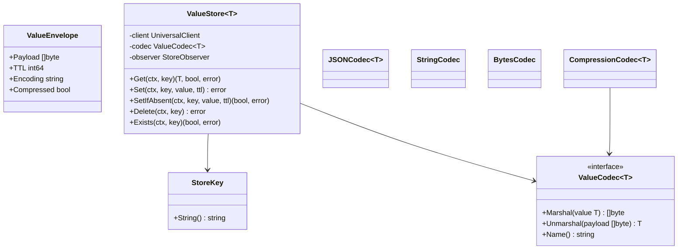

### 模型说明

- `StoreKey`
  - typed store 的键值对象
- `ValueCodec[T]`
  - 编解码策略接口
- `ValueEnvelope`
  - 用于描述载荷及其元数据的值对象
- `ValueStore[T]`
  - 最小 typed store 领域服务

---

## 7.4 Lease 子域模型

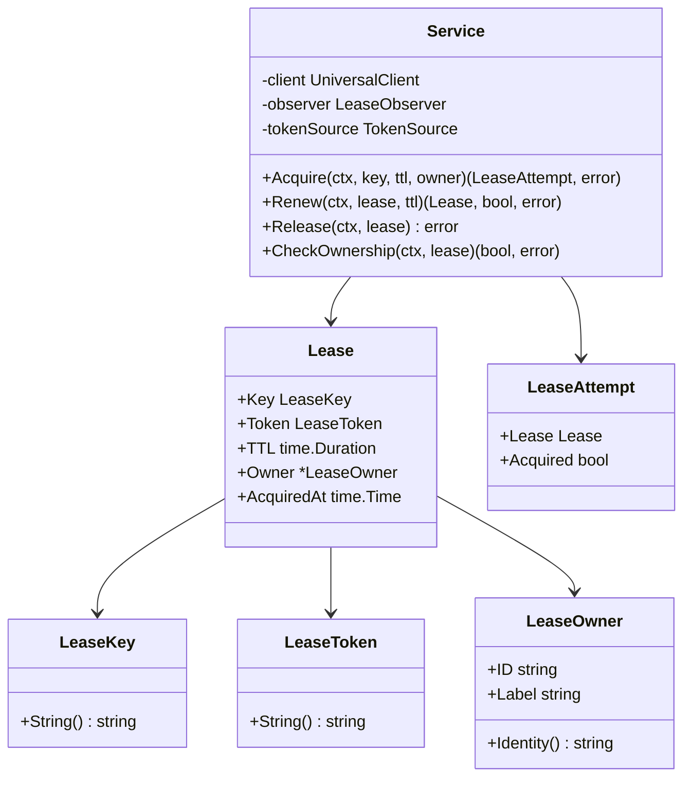

### 模型说明

- `LeaseKey`
  - 锁键值对象
- `LeaseToken`
  - 锁持有 token 值对象
- `LeaseOwner`
  - 锁拥有者元数据
- `Lease`
  - 已获取租约实体
- `LeaseAttempt`
  - acquire 结果值对象
- `Service`
  - 租约锁领域服务

---

## 8. 领域服务

## 8.1 Runtime 服务

### `runtime.Registry`

职责：

- 管理默认连接
- 管理命名 profile
- 提供 profile 绑定解析
- 执行连接建立
- 提供 profile 状态查询
- 负责 profile 不可用重试恢复

核心方法：

- `Connect()`
- `HealthCheck()`
- `Default()`
- `ByProfile()`
- `Bind()`
- `Client()`
- `Status()`
- `Profiles()`

### `runtime.Handle`

职责：

- 封装底层 `go-redis` client
- 绑定 profile 元数据
- 统一 `Connect/Close/HealthCheck`

---

## 8.2 Keyspace 服务

### `keyspace.Keyspace`

职责：

- 管理 namespace
- 管理子命名空间派生
- 统一前缀拼接
- 统一模式拼接

关键价值：

- 下游仓不再手写 `"prefix:" + key`
- namespace 规范化收口到一个地方

---

## 8.3 Ops 服务

### `ops.ScanKeys`

职责：

- 统一 SCAN 扫描逻辑

### `ops.DeleteByPattern`

职责：

- 统一按模式删除逻辑
- 支持 `BatchSize`
- 支持 `DeleteTimeout`
- 支持 `DryRun`
- 支持 `OnBatch`

### `ops.ConsumeIfExists`

职责：

- 基于 Lua 执行原子检查 + 删除

### `ops.JitterTTL`

职责：

- 为 TTL 提供对称抖动，防止同时失效

---

## 8.4 Store 服务

### `store.ValueStore[T]`

职责：

- typed get
- typed set
- set-if-absent
- exists
- delete

设计约束：

- 不做 read-through
- 不做 negative cache
- 不做 singleflight
- 不做 version token
- 不做 local hot cache

### `store.ValueCodec[T]`

职责：

- 把 “值” 与 “字节” 的互转策略抽象出来

默认 codec：

- `JSONCodec[T]`
- `StringCodec`
- `BytesCodec`
- `CompressionCodec[T]`

---

## 8.5 Lease 服务

### `lease.Service`

职责：

- 获取锁
- 续约锁
- 释放锁
- 检查 ownership

内部策略：

- `Acquire`
  - `SET NX EX`
- `Release`
  - Lua compare-and-delete
- `Renew`
  - Lua compare-and-expire
- `CheckOwnership`
  - compare current value vs token

---

## 9. 设计模式

Foundation 层统一使用以下模式。

| 模式 | 用途 | 代码位置 |
|---|---|---|
| Factory | 创建 runtime / store / lease service | `runtime.New`、`store.NewValueStore`、`lease.NewService` |
| Facade | 对外暴露稳定入口 | `runtime.Runtime`、兼容层 `pkg/database` / `pkg/redis` |
| Strategy | codec、token 生成器、fallback 策略 | `ValueCodec[T]`、`TokenSource`、`WithFallbackOnMissing` |
| Adapter | 兼容旧 API，桥接新实现 | `pkg/database/redis*.go`、`pkg/redis/*.go` |
| Value Object | 保证键、token、namespace 等值语义稳定 | `Namespace`、`StoreKey`、`LeaseKey` |
| Compatibility Wrapper | 增量迁移期间保留旧入口 | `AcquireLease`、`NewKeyspace`、`NamedRedisRegistry` |

明确不使用：

- Repository 模式
- Read-through cache 模式
- Governance coordinator 模式
- 业务聚合建模

---

## 10. 关键交互流程

## 10.1 Runtime 绑定与回退流程

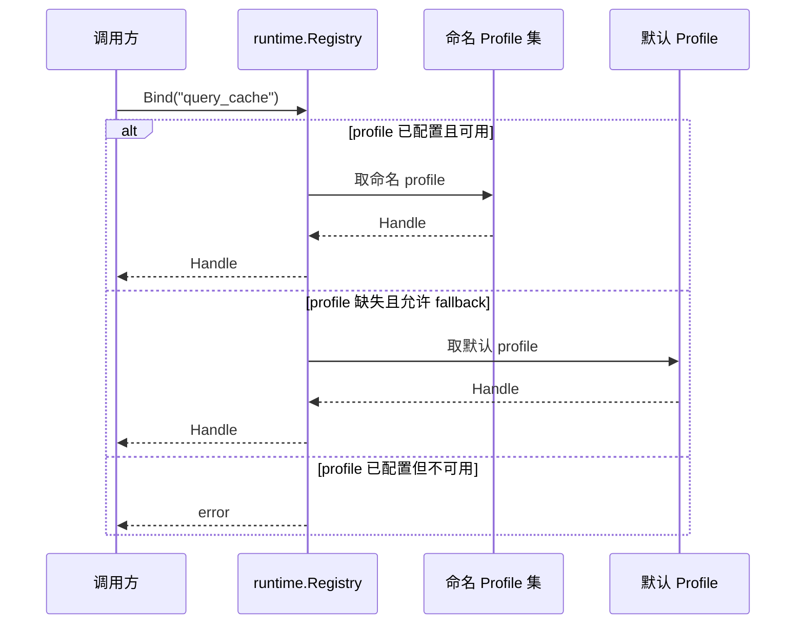

---

## 10.2 Runtime 健康检查与恢复

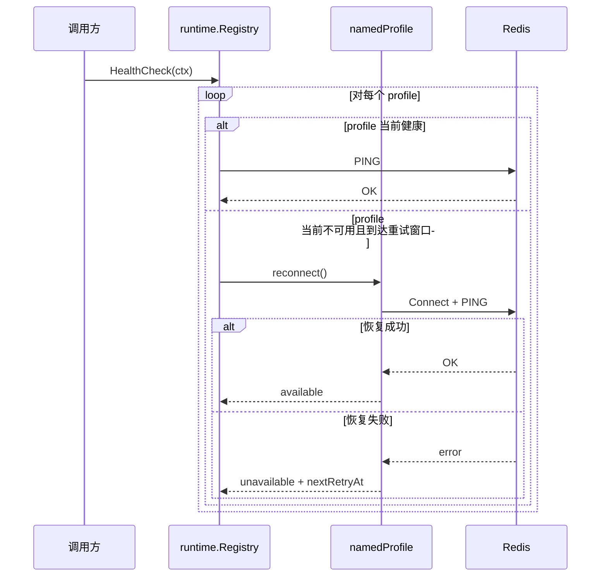

---

## 10.3 Typed Store 读流程

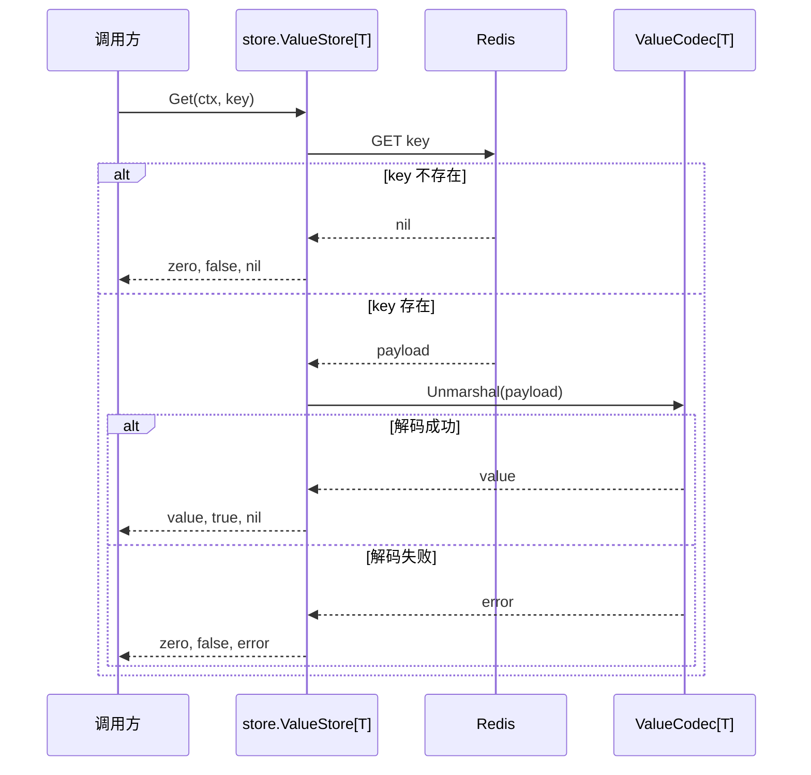

---

## 10.4 Typed Store 写流程

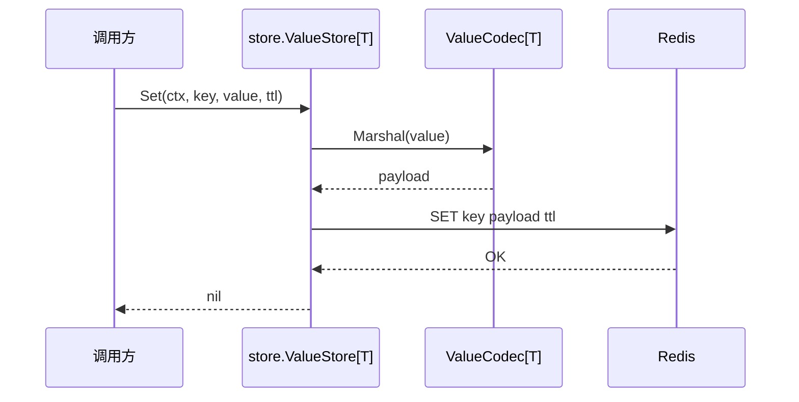

---

## 10.5 Lease Acquire / Renew / Release

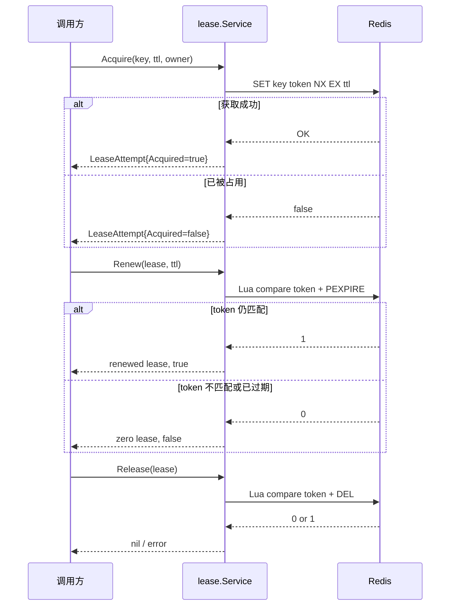

---

## 10.6 兼容层委托关系

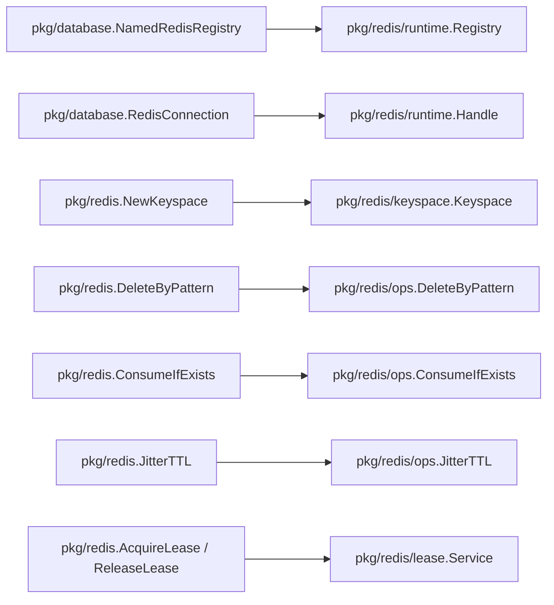

---

## 11. 与下游仓的关系

## 11.1 `qs-server`

Foundation 适合提供：

- runtime/profile binding
- keyspace
- delete by pattern
- jitter
- lease service

仍应留在 `qs-server` 的能力：

- cache runtime
- versioned query cache
- cache governance
- hotset / warmup / status page
- local hot cache

## 11.2 `iam-contracts`

Foundation 适合提供：

- typed store
- keyspace
- lease service
- runtime binding

业务 adapter 仍保留在 IAM 仓：

- refresh token store
- otp verifier
- wechat access token cache
- wechat sdk cache

---

## 12. 使用建议

## 12.1 新代码推荐入口

新代码应优先直接使用：

- `pkg/redis/runtime`
- `pkg/redis/keyspace`
- `pkg/redis/ops`
- `pkg/redis/store`
- `pkg/redis/lease`
- `pkg/redis/observability`

## 12.2 旧代码迁移策略

旧代码可继续使用：

- `pkg/database.NamedRedisRegistry`
- `pkg/database.RedisConnection`
- `pkg/redis.NewKeyspace`
- `pkg/redis.DeleteByPattern`
- `pkg/redis.ConsumeIfExists`
- `pkg/redis.JitterTTL`
- `pkg/redis.AcquireLease`
- `pkg/redis.ReleaseLease`

但这些入口现在都已经变成兼容壳，建议后续逐步迁移。

---

## 13. 迁移路线建议

### 阶段 1：Foundation 先稳定

- 新增 runtime / keyspace / ops / store / lease / observability
- 旧入口委托到新实现
- 保证全量测试通过

### 阶段 2：优先迁 `iam-contracts`

- refresh token store
- otp verifier / send gate
- wechat access token cache

因为这些场景最适合用 `store + lease + keyspace`

### 阶段 3：再迁 `qs-server`

- 先迁 `redislock`
- 再迁 runtime/profile binding
- 保持 cache runtime/governance 留在 `qs-server`

---

## 14. 当前边界判断

Foundation 当前的核心边界可以用一句话描述：

> Foundation 提供 “Redis 运行时 + 基础原语 + 最小 typed store + 租约锁”，并通过兼容层保护现有调用方；任何业务缓存平台与治理逻辑都不应进入 Foundation。

这条边界是后续三仓 Redis 重构的前提。如果这条边界保持稳定：

- `component-base` 会更像真正的平台底座
- `qs-server` 可以把注意力放在 cache runtime / governance
- `iam-contracts` 可以把注意力放在业务 adapter，而不是重复造 Redis 轮子

